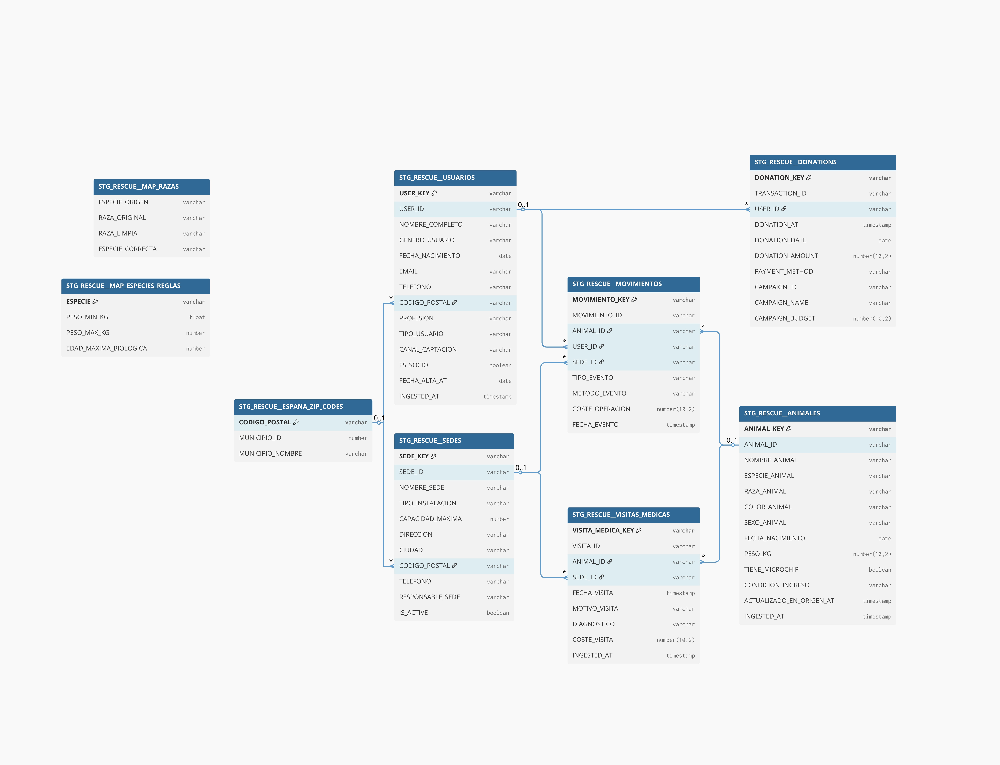
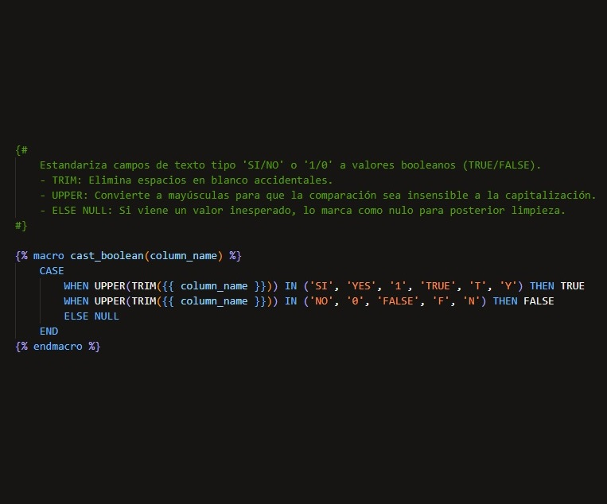
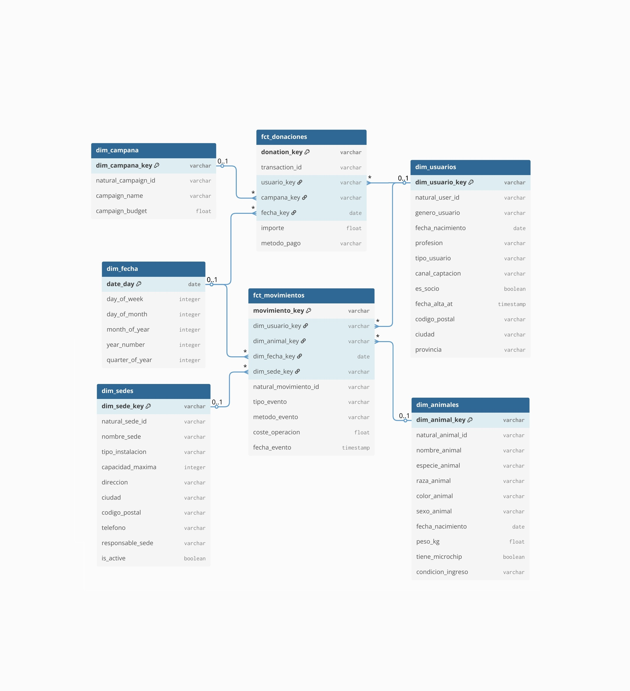
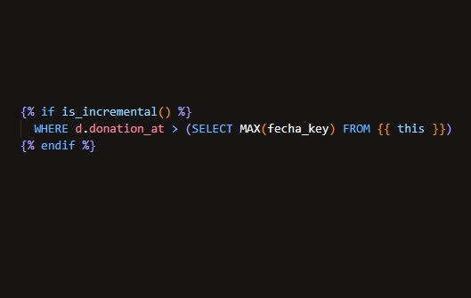
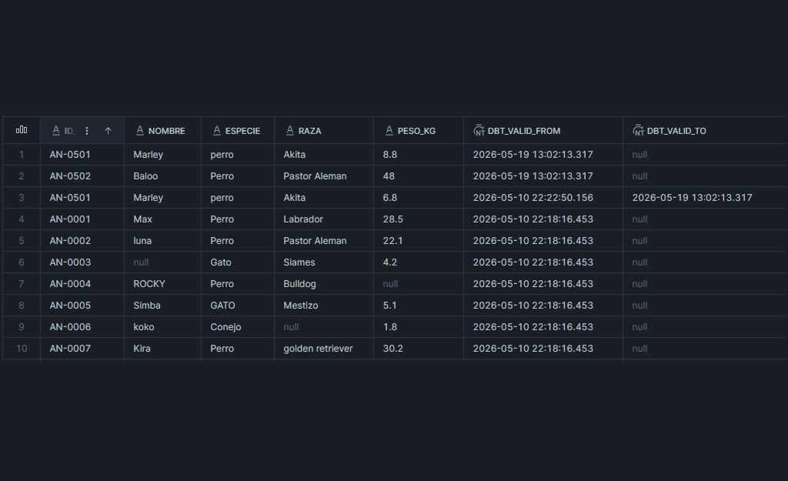

# 🐾 Pipeline Rescue: Data Engineering Project


Este repositorio contiene el pipeline de datos *End-to-End* para una red de refugios de animales. El objetivo principal es extraer datos operativos desde archivos locales (CSVs), cargarlos en un Data Warehouse, y transformarlos en un modelo analítico robusto (Esquema en Estrella) listo para ser consumido por herramientas de Business Intelligence (como Power BI).

## 🎯 Contexto y Valor de Negocio

Una red de protectoras en crecimiento operaba con **múltiples sedes descentralizadas**, enfrentando un problema crítico: la información operativa estaba fragmentada, sin normalizar y almacenada en archivos locales generados manualmente por voluntarios. 

Este sistema centraliza, limpia y gobierna los datos en la nube para dar respuesta a **preguntas estratégicas** mediante un Dashboard interactivo:

*   **Adopciones (Rotación):** ¿Qué perfiles biológicos de animales se adoptan más rápido frente a los que sufren estancamiento?
*   **Marketing y Donaciones:** ¿Cuál es el retorno de inversión (ROI) real de las campañas de captación de fondos y quiénes son los donantes más fieles?
*   **Operaciones:** ¿Cuál es el nivel de saturación física, ocupación real vs. capacidad máxima y la carga de trabajo actual en cada uno de los refugios?

<p align="center">
  
</p>

---

## 🚀 Stack Tecnológico

*   🐍 **Lenguaje Principal:** Python 3 y SQL.
*   ❄️ **Almacenamiento (Data Warehouse):** Snowflake.
*   🔄 **Transformación y Modelado:** dbt (Data Build Tool).
*   📊 **Visualización y BI:** Power BI.
*   ⚙️ **Control de Versiones:** Git / GitHub.

---

## � Arquitectura del Pipeline (Medallion)

<p align="center">
  
</p>

1. 🥉 **Capa Bronze (RAW) - "Ingesta Defensiva":** Ingesta mediante un script en **Python** (`_ingestion/ingesta.py`). Se aplica una **"VARCHAR Strategy"**, cargando todo como texto para blindar la ejecución contra fallos de tipado desde el origen, y se inyecta un timestamp de auditoría (`_loaded_at`).
2. 🥈 **Capa Silver (Staging) - "Data Cleansing":** Tipado fuerte y limpieza en **dbt**. Incluye aplanamiento de datos anidados (JSON), estandarización de booleanos sucios (`'sí', 't', '1' -> TRUE`), corrección de métricas negativas mediante `ABS()`, funciones reutilizables (**Macros**) y uso de **Seeds** como *Fuente de la Verdad* (Master Data).

<p align="center">
  
  &nbsp; &nbsp; &nbsp;
  
</p>

3. 🥇 **Capa Gold (Marts / Core) - "Orientación a Negocio":** Modelo dimensional (Esquema en Estrella). Implementación de carga incremental para tablas de hechos y uso de paquetes de dbt para generar una **Dimensión Fecha** dinámica, esencial para el análisis de series temporales.

---

## 📂 Estructura del Repositorio

```text
pipeline-rescue/
├── _ingestion/             # Scripts de ingesta de datos
│   └── ingesta.py          # Script de Python que sube CSVs locales a Snowflake
├── models/                 # Modelos de dbt
│   ├── staging/            # Capa SILVER (Limpieza, normalización y parseo)
│   │   ├── _sources.yml    # Definición de fuentes y métricas de frescura (freshness)
│   │   └── stg_rescue__*.sql
│   └── marts/core/         # Capa GOLD (Esquema en Estrella)
│       ├── dim_*.sql       # Dimensiones (Usuarios, Animales, Sedes...)
│       └── fct_*.sql       # Tablas de Hechos Incrementales (Movimientos, Donaciones)
├── tests/                  # Pruebas personalizadas de dbt
│   └── assert_movimientos_coste_positivo.sql # Reglas de negocio críticas
└── README.md               # Documentación del proyecto
```

---

## ⚙️ Modelado de Datos (Capa Analítica)

El data warehouse está diseñado mediante un **esquema en estrella** en la capa `marts` para optimizar las consultas analíticas:

<p align="center">
  
</p>

### 🌟 Dimensiones (`dim_`)
Contienen el contexto descriptivo. Incluyen lógica avanzada como la creación de *Golden Records* (deduplicación) y la gestión de valores nulos o desconocidos mediante *Dummy Records* (ID = -1).
*   `dim_usuarios`: Información de adoptantes, donantes y perfiles enriquecidos con datos geográficos.
*   `dim_animales`: Información de los animales del refugio.
*   `dim_sedes`: Información de los centros y refugios.

### 📊 Tablas de Hechos (`fct_`)
Almacenan las métricas y eventos. Están configuradas de forma **incremental** en dbt para procesar únicamente los datos nuevos de forma eficiente y evitar cruces costosos de datos históricos.

<p align="center">
  
</p>

*   `fct_movimientos`: Traslados y operaciones.
*   `fct_donaciones`: Registro de aportaciones económicas (extraídas de un payload JSON anidado).

---

## 🌳 Grafo de Linaje (DAG)

La transformación de datos genera un linaje claro y auditable. A continuación se muestra el DAG (*Directed Acyclic Graph*) nativo de dbt, trazando el recorrido del dato desde las fuentes RAW hasta el Esquema en Estrella final:

<p align="center">
  
</p>

---

## 🧠 Retos Técnicos y Soluciones

Durante el desarrollo de este pipeline, se abordaron desafíos complejos de ingeniería de datos:

* **Integridad en Datos Huérfanos:** Se detectaron registros de adopción que apuntaban a animales no registrados en el sistema de origen. **Solución:** Implementación de *Ghost Records* (ID `-1`) en la capa Gold mediante una `UNION ALL` en dbt, permitiendo que el 100% de las donaciones sean auditables en Power BI sin perderse por *inner joins* fallidos.
* **Eliminación de Duplicados (Fan-out Prevention):** Los eventos de entrada presentaban duplicidades técnicas. **Solución:** Uso de la cláusula `QUALIFY` combinada con `ROW_NUMBER() OVER (PARTITION BY ... ORDER BY ...)` en los modelos de Staging para garantizar que solo el evento de entrada más reciente sea procesado.
* **Cálculo de Costes Agregados:** Era necesario vincular múltiples revisiones médicas a un solo animal. **Solución:** Creación de una lógica de agregación en la capa Silver que pre-calcula los costes antes de unirlos a la dimensión final, optimizando el rendimiento de las consultas en el Data Warehouse.

---

## 🛡️ Calidad y Robustez (Enterprise-Grade)

Además de los retos mencionados, se implementaron de manera transversal las siguientes salvaguardas técnicas:

* **Cumplimiento RGPD y PII:** Anonimización de datos personales sensibles en la Dimensión Usuarios, ocultando teléfonos, direcciones y correos en la capa de consumo final.
* **Control de Historial (SCD Tipo 2):** Implementación de *Snapshots* en dbt (`WHERE dbt_valid_to IS NULL`) para capturar la evolución de los datos en el tiempo, asegurando tener siempre la "foto actual" sin perder el contexto histórico.
* **Validación de Reglas Biológicas y Geográficas:** Conversión a `NULL` de pesos o edades biológicamente imposibles en lugar de descartar el registro entero, y cruce referencial con semillas estáticas (`espana_zip_codes`) para certificar la latitud y longitud.
* **Data Testing Exhaustivo:** Cobertura de tests automatizados de dbt para validar unicidad, no nulidad, y relaciones foráneas consistentes (`relationships`) en cada ejecución, sumado a pruebas lógicas de paquetes como `dbt_utils`.

<p align="center">
  
</p>

---

## ⚙️ DataOps y Despliegue en Producción

El ciclo de vida del pipeline se gestiona bajo filosofía DataOps para entornos escalables:

*   **Enrutamiento Dinámico y Entornos Aislados:** Uso de variables de entorno (`{{ env_var('DBT_SILVER_DB') }}`) en `dbt_project.yml` para desplegar dinámicamente en bases de datos de DEV o PROD usando el mismo código fuente, previniendo accidentes en producción.
*   **Orquestación Automatizada:** Ejecución de transformaciones gestionada de forma autónoma mediante **Jobs de dbt Cloud** (`dbt run`, `dbt test`).
*   **Monitoreo de Frescura:** Verificación automatizada (`source freshness`) en la capa RAW para disparar alertas si los datos operativos se retrasan más de 24 horas.

<p align="center">
  
</p>

---

## �️ Configuración y Prerrequisitos

### 1. Variables de Entorno
Crea un archivo `.env` en la raíz (ignorado en Git) para no exponer credenciales:

```env
SNOWFLAKE_ACCOUNT=tu_cuenta_snowflake
SNOWFLAKE_USER=tu_usuario
SNOWFLAKE_PASSWORD=tu_password
```

### 2. Dependencias Locales
Debes tener instalado Python y los siguientes paquetes:
```bash
pip install snowflake-connector-python python-dotenv dbt-snowflake
```

---

## 🏃‍♂️ Ejecución del Pipeline

### Paso 1: Ingesta a la Capa Bronce (RAW)
Asegúrate de tener los archivos `.csv` en la carpeta correspondiente de tu escritorio (`Desktop/Rescue_animal`). Ejecuta el script de ingesta para llevar los datos a la capa RAW de Snowflake:

```bash
python _ingestion/ingesta.py
```
*Este script se encargará de crear el stage, limpiar las tablas previas, realizar el comando `COPY INTO`, e inyectar el timestamp de auditoría `_loaded_at`.*

### Paso 2: Transformación a Capas Plata y Oro (dbt)
Una vez los datos están en Snowflake, dbt se encarga de todo el modelado, parseo de JSON, generación de claves subrogadas y cruces:

```bash
# Validar que las fuentes de datos estén frescas (según reglas en _sources.yml)
dbt source freshness

# Ejecutar todos los modelos (creación de vistas Staging y actualización de Hechos/Dimensiones)
dbt run

# Ejecutar tests genéricos y pruebas lógicas para asegurar la calidad del dato
dbt test
```

---

## 🧪 Calidad de Datos y Tests

El proyecto utiliza los tests nativos de dbt y tests singulares (`tests/`) para asegurar la fiabilidad. Un ejemplo es el test `assert_movimientos_coste_positivo` que bloquea y alerta si se registra en Snowflake una operación con coste negativo. También se hace uso del paquete `dbt_utils` para garantizar la generación correcta de *Surrogate Keys*.

<p align="center">
  
</p>

---

## 🚀 Roadmap y Futuras Mejoras (Enterprise Scale)

Para escalar este proyecto a un nivel de producción masivo, se proponen las siguientes evoluciones arquitectónicas:

1. **Contenedores y Orquestación:** Empaquetar el script `ingesta.py` mediante **Docker** para desacoplarlo del sistema operativo local. Integrar **Apache Airflow** o **Dagster** para gobernar el flujo completo (Ingesta -> Transformación -> Testing).
2. **CI/CD y Code Quality:** Implementar pipelines en **GitHub Actions** que ejecuten validaciones automáticas de código mediante **SQLFluff** (Linting SQL) y despliegues incrementales (*Slim CI* de dbt) ante cada Pull Request.
3. **Transición a Data Lake y Streaming:** Reemplazar el almacenamiento local y el `COPY INTO` manual por un Data Lake nativo (Amazon S3 / Azure Blob Storage), utilizando **Snowpipe** para una ingesta automática y casi en tiempo real (*near real-time*).
4. **Data Observability:** Integración de paquetes de observabilidad como **Elementary** en dbt para monitorizar el volumen de datos, detectar anomalías estadísticas en las donaciones y enviar reportes automáticos vía Slack.

---

## 📩 Contacto

Si tienes alguna pregunta sobre la arquitectura del proyecto, recomendaciones de mejora o simplemente quieres conectar, ¡no dudes en escribirme!

<p align="left">
<a href="https://www.linkedin.com/in/cesarbetancorcano/" target="blank"></a>
</p>

* **LinkedIn:** [César Betancor Cano](https://www.linkedin.com/in/cesarbetancorcano/)
* **Portfolio:** [btncr13.github.io](https://btncr13.github.io/portfolio/)
* **Email:** [betancor13@gmail.com](mailto:betancor13@gmail.com)

---

## 📄 Licencia

Este proyecto se distribuye bajo la Licencia MIT. Siéntete libre de usarlo, modificarlo y distribuirlo para fines educativos o profesionales.

---